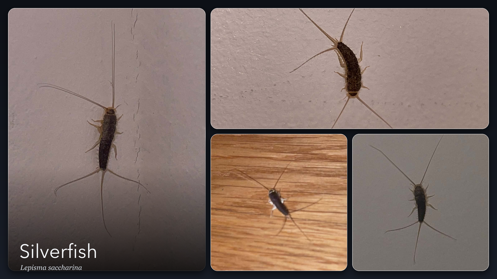

# About the name

> Heads-up: there's a close-up photo of a silverfish further down this page. If insects aren't your thing, you've been warned.

ChromiumFish has nothing to do with fish.

It's named after the silverfish, *Lepisma saccharina*, the little teardrop-shaped bug that shoots out from behind the bookshelf at 2am and is gone before you're even sure you saw it.

We've got them in our flat. My wife wants them gone. I've somehow ended up on their side, and it's been a low-level argument in our house ever since.

She's not wrong, to be fair. They eat the spines of books, they appear out of nowhere, and they move like they know they're not supposed to be there.

But hear me out. Silverfish have been around for about 400 million years, which makes them older than the dinosaurs and older than trees. They've made it through four of the planet's five great mass extinctions with no armor, no speed, and no real plan. They just stayed small, kept to the dark, ate almost nothing, and were never worth the trouble of hunting. The asteroid that killed the dinosaurs barely touched them. They were fine. They still are.

I think that's amazing. My wife thinks it's revolting. So, honestly, the name is partly just me keeping the argument going.

Every star this repo gets is a point for my side. And I hold up my end of it. There's a little dish of starch behind the radiator, and they know where it is.

It fits the project anyway. A silverfish survives by going unnoticed. No trail, no signature, nothing worth following. Which is basically the whole idea behind a browser that doesn't want to be fingerprinted.
