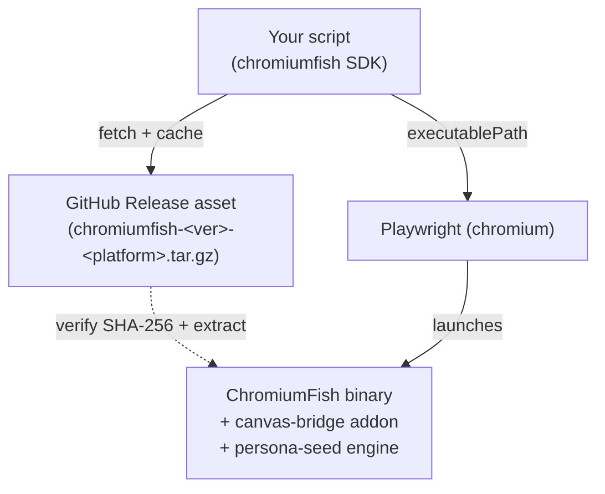

<div align="center">


# ChromiumFish

### A stealth Chromium build with a drop-in Playwright harness — for Python and Node.

[](https://pypi.org/project/chromiumfish/)
[](https://www.npmjs.com/package/chromiumfish)
[](LICENSE)
[](https://playwright.dev)

[Docs](https://chromiumfish.com) · [Python SDK](packages/python-sdk) · [JS SDK](packages/js-sdk) · [Releases](https://github.com/arman-bd/chromiumfish/releases) · [The name 🐟](NAMING.md)

</div>

---

**ChromiumFish** is a fingerprint-hardened Chromium fork that presents a coherent, consistent browser persona — spoofed natively in C++, not patched in JavaScript, so there are no tampering tells. This repo is the **distribution + automation harness**: it hosts the prebuilt browser as GitHub Release assets and ships matching **`pip`** and **`npm`** packages that download the right build and launch it through Playwright with familiar, drop-in ergonomics.

```python
from chromiumfish.sync_api import Chromiumfish

with Chromiumfish(persona_seed=27182, headless=True) as browser:
    page = browser.new_page()
    page.goto("https://abrahamjuliot.github.io/creepjs/")
    page.screenshot(path="fingerprint.png")
```

```javascript
import { ChromiumFish } from "chromiumfish";

const browser = await ChromiumFish({ personaSeed: 27182, headless: true });
const page = await browser.newPage();
await page.goto("https://abrahamjuliot.github.io/creepjs/");
await browser.close();
```

## ✨ Features

- 🧬 **Native fingerprint spoofing** — UA, Client Hints, WebGL (D3D11/ANGLE), fonts, audio, and canvas are spoofed in the engine. `navigator.webdriver` is `false` even under CDP, with zero `cdc_` automation artifacts.
- 🎭 **Per-seed personas** — one `persona_seed` → one stable, internally-consistent identity. Rotate the seed for a fresh, uncorrelated persona; reuse it for cross-session continuity.
- 🎨 **Bundled canvas-bridge addon** — deterministic, per-seed canvas/WebGL isolation ships inside the build. No external service required.
- 🤝 **Drop-in Playwright** — it *is* Chromium, so everything you know about Playwright works. The SDK is a thin wrapper over `chromium.launch(executablePath=…)`.
- 📦 **One line to install** — `pip install chromiumfish` or `npm i chromiumfish`. The binary is fetched and cached on first run.
- 🖥️ **Headless-friendly** — runs on GPU-less Linux via SwiftShader.

## 📦 Installation

### Python
```bash
pip install chromiumfish
chromiumfish fetch        # download + cache the browser build
```

### Node
```bash
npm install chromiumfish
npx chromiumfish fetch
```

Both SDKs require [Playwright](https://playwright.dev) (a peer dependency) and pull the browser binary from this repo's [Releases](https://github.com/arman-bd/chromiumfish/releases) on first use, caching it under `~/.cache/chromiumfish/<version>/`.

## 🧠 How it works



The browser itself is the Chromium fork that lives in this same repo (`patches/` + `assets/` applied over an upstream checkout), built and published as a Release. The SDKs resolve `version → platform asset`, verify its SHA-256, extract it, and hand the path to Playwright. See the [Quickstart](https://chromiumfish.com/quickstart).

Three pieces, three jobs:

| Piece | Its one job | Why it matters |
|-------|-------------|----------------|
| **The browser** | Hides you | UA, screen, GPU, fonts, audio, canvas, WebRTC spoofed in the C++ engine — not an extension or injected script, so "is this tampered with?" probes find nothing. |
| **The SDK** | Runs it | `pip install` / `npm i`, then fetch → verify → cache → launch via Playwright. Zero fingerprinting logic, nothing to keep in sync. |
| **The persona seed** | Picks who you are | One number → one coherent identity, correlated like real hardware (8 cores → plausible RAM). Same seed = same person; new seed = a clean, unlinkable one. |

## 📚 Documentation

Full docs live at **[chromiumfish.com](https://chromiumfish.com)** (built with [Just the Docs](https://just-the-docs.com) from [`docs/`](docs/)):
- [Introduction](https://chromiumfish.com/)
- [Installation](https://chromiumfish.com/installation) · [Quickstart](https://chromiumfish.com/quickstart) · [Personas](https://chromiumfish.com/personas)
- [Python API](https://chromiumfish.com/api/python) · [JavaScript API](https://chromiumfish.com/api/javascript)

## 🗂️ Repository layout

This repo is a monorepo: the **browser fork** (the source delta) and the **distribution + automation harness** (SDKs, docs) live side by side.

```
chromiumfish/
├── patches/          # the fork's source delta over upstream Chromium
├── assets/           # binary build overlays (icons, fonts) rsync'd into src/
├── apply.sh          # apply patches/ + assets/ onto ./src/
├── UPSTREAM_REVISION # exact upstream commit the fork is authored against
├── packages/
│   ├── python-sdk/   # `chromiumfish` on PyPI
│   └── js-sdk/       # `chromiumfish` on npm
├── docs/             # Just the Docs site (+ docs/assets/ brand artwork)
├── README.md
└── LICENSE
```

> The Chromium checkout itself (`src/`) and build output (`out/`, `dist/`) are not tracked — see [`.gitignore`](.gitignore). The fork is reconstructed by applying `patches/` + `assets/` onto a matching upstream checkout.

## 🐛 About the name

ChromiumFish has nothing to do with fish — it's named after the **silverfish**, a 400-million-year-old insect that has survived four mass extinctions by going completely unnoticed. No armor, no speed, no trail worth following — which is exactly the idea behind a browser that doesn't want to be fingerprinted. The [full story is here](NAMING.md).

## ⚠️ Disclaimer

ChromiumFish is provided **for educational and authorized research purposes only** — learning how browser fingerprinting works, testing the resilience of systems you own or are explicitly permitted to test, and privacy research.

You are solely responsible for how you use it. Use it only in compliance with all applicable laws and with the terms of service of any site or service you interact with. Do **not** use it for fraud, unauthorized access, evading security controls, or any other unlawful or abusive activity.

The software is provided **"as is", without warranty of any kind**, express or implied. To the maximum extent permitted by law, the author and contributors accept **no liability** for any claim, damage, or other loss arising from its use or misuse. By using ChromiumFish you accept full responsibility for your actions.

## ⚖️ License

[MIT](LICENSE) © Arman Hossain. ChromiumFish is built on the [Chromium](https://www.chromium.org/) project (BSD-3-Clause); the browser distribution bundles Chromium's license and credits. "Chromium" and "Google Chrome" are trademarks of Google LLC; ChromiumFish is an independent fork and is not affiliated with or endorsed by Google.
