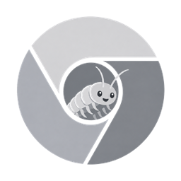
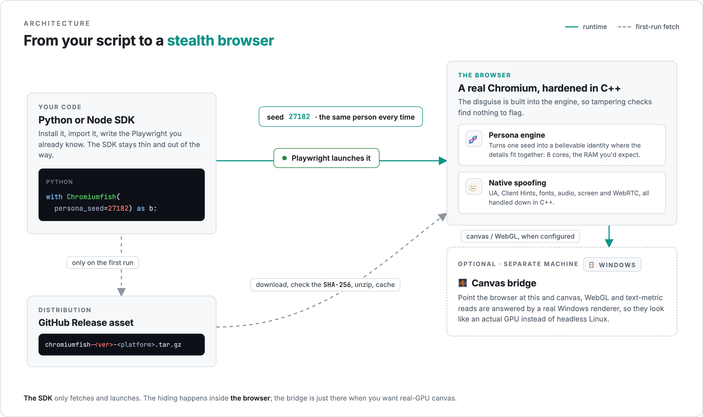

<div align="center">



# ChromiumFish

### Stealth Chromium with a drop-in Playwright harness, for Python and Node.

[](https://pypi.org/project/chromiumfish/)
[](https://www.npmjs.com/package/chromiumfish)
[](LICENSE)
[](https://playwright.dev)

[Docs](https://chromiumfish.com) · [Python SDK](packages/python-sdk) · [JS SDK](packages/js-sdk) · [Releases](https://github.com/arman-bd/chromiumfish/releases) · [The name 🐟](NAMING.md)

Need help getting through a tough site? Reach out — **Arman Hossain** on [LinkedIn](https://www.linkedin.com/in/armanhossain) or at [arman@bytetunnels.com](mailto:arman@bytetunnels.com)

</div>

---

**ChromiumFish** is a fingerprint-hardened Chromium fork that presents one coherent browser identity. Because the spoofing happens down in the C++ engine instead of in injected JavaScript, there's nothing for "is this tampered with?" checks to catch.

This repo is the part that gets it onto your machine and into your script. It publishes the prebuilt browser as GitHub Release assets and ships matching `pip` and `npm` packages that grab the right build for your platform and launch it through Playwright — so if you already know Playwright, you already know how to drive it.

**Install**

```bash
pip install chromiumfish   # Python
npm install chromiumfish   # Node
```

**🐍 Python**

```python
from chromiumfish.sync_api import Chromiumfish

with Chromiumfish(persona_seed=27182, headless=True) as browser:
    page = browser.new_page()
    page.goto("https://abrahamjuliot.github.io/creepjs/")
    page.screenshot(path="fingerprint.png")
```

**⬢ Node**

```javascript
import { ChromiumFish } from "chromiumfish";

const browser = await ChromiumFish({ personaSeed: 27182, headless: true });
const page = await browser.newPage();
await page.goto("https://abrahamjuliot.github.io/creepjs/");
await browser.close();
```

## 🪤 Why I built this

I scrape the web at scale, and some sites fight back hard. I worked through most of the open-source stealth browsers and a couple of paid ones, and they kept failing the same way: they run on a Linux server and try to look like they aren't, but they do it with JavaScript patches. That's a bad place to hide. A JS patch leaves tampering marks right where the "has this been messed with?" checks are looking, and the detectors I cared about caught them every time. So I moved the spoofing down into the C++ engine, where there's nothing for a tampering probe to find, and started using it to unblock my own scrapers. It has since gotten me through a few sites that had blocked everything else I tried.

## ✨ What you get

- 🧬 **Spoofing in the engine, not in a script.** UA, Client Hints, fonts, audio, screen, and WebRTC are spoofed inside Chromium itself. `navigator.webdriver` stays `false` even under CDP, and there are no `cdc_` automation artifacts lying around.
- 🎭 **One seed, one persona.** A single `persona_seed` gives you a stable, internally-consistent identity. Change the seed for a fresh, unlinkable one; keep it for continuity across sessions.
- 🎨 **Canvas & WebGL through an optional bridge.** These are the hardest signals to fake from a headless Linux box, where SwiftShader gives you away. Point ChromiumFish at a small render bridge running on Windows and canvas/WebGL reads come back from a real machine instead. It's a separate, optional service, not bundled in the binary.
- 🤝 **It's just Playwright.** Because it *is* Chromium, everything you already do in Playwright works unchanged. The SDK is a thin wrapper over `chromium.launch(executablePath=…)`.
- 📦 **Install in one line.** `pip install chromiumfish` or `npm i chromiumfish`; the binary downloads and caches itself the first time you run it.
- 🖥️ **Happy headless.** Runs on GPU-less Linux via SwiftShader.

## 📦 Installation

### Python
```bash
pip install chromiumfish
chromiumfish fetch        # download + cache the browser build
```

### Node
```bash
npm install chromiumfish
npx chromiumfish fetch
```

Both SDKs need [Playwright](https://playwright.dev) (it's a peer dependency). On first use they pull the browser binary from this repo's [Releases](https://github.com/arman-bd/chromiumfish/releases) and cache it under `~/.cache/chromiumfish/<version>/`, so you only pay the download once.

> **Platforms:** prebuilt for **macOS** and **Linux** today. A **Windows** build is coming soon.

## 🧠 How it works

<div align="center">
  
</div>

The browser is the Chromium fork that lives in this same repo — `patches/` + `assets/` applied over an upstream checkout, then built and published as a Release. The SDK does very little: figure out which asset matches your version and platform, check its SHA-256, unpack it, and hand the path to Playwright. The [Quickstart](https://chromiumfish.com/quickstart) walks through it.

It comes down to three pieces, each doing one thing:

| Piece | What it does | Why it matters |
|-------|--------------|----------------|
| **The browser** | Hides you | UA, screen, fonts, audio and WebRTC are spoofed in the C++ engine — no extension, no injected script, so "is this tampered with?" probes find nothing. Canvas and WebGL can be routed through the optional Windows bridge for a real-GPU result. |
| **The SDK** | Runs it | `pip install` / `npm i`, then fetch → verify → cache → launch via Playwright. Zero fingerprinting logic, nothing to keep in sync. |
| **The persona seed** | Picks who you are | One number → one coherent identity, correlated like real hardware (8 cores → plausible RAM). Same seed = same person; new seed = a clean, unlinkable one. |

## 📚 Docs

The full docs live at **[chromiumfish.com](https://chromiumfish.com)** (built with [Just the Docs](https://just-the-docs.com) from [`docs/`](docs/)):
- [Introduction](https://chromiumfish.com/)
- [Installation](https://chromiumfish.com/installation) · [Quickstart](https://chromiumfish.com/quickstart) · [Personas](https://chromiumfish.com/personas)
- [Python API](https://chromiumfish.com/api/python) · [JavaScript API](https://chromiumfish.com/api/javascript)

## 🗂️ What's in here

It's a monorepo. The browser fork (just the source delta over upstream) and the things that ship it — the SDKs and docs — sit side by side.

```
chromiumfish/
├── patches/          # the fork's source delta over upstream Chromium
├── assets/           # binary build overlays (icons, fonts) rsync'd into src/
├── apply.sh          # apply patches/ + assets/ onto ./src/
├── UPSTREAM_REVISION # exact upstream commit the fork is authored against
├── packages/
│   ├── python-sdk/   # `chromiumfish` on PyPI
│   └── js-sdk/       # `chromiumfish` on npm
├── docs/             # Just the Docs site (+ docs/assets/ brand artwork)
├── README.md
└── LICENSE
```

> The Chromium checkout (`src/`) and build output (`out/`, `dist/`) aren't tracked — see [`.gitignore`](.gitignore). You rebuild the fork by applying `patches/` + `assets/` onto a matching upstream checkout.

## 🐛 Where the name comes from

It's not about fish. The name is for the **silverfish**, a 400-million-year-old insect that has sat out four mass extinctions by simply never being noticed — no armor, no speed, no trail worth following. That's the whole idea behind a browser that would rather not be fingerprinted. [The longer story is here](NAMING.md).

## ⚠️ Disclaimer

ChromiumFish is provided **for educational and authorized research purposes only** — learning how browser fingerprinting works, testing the resilience of systems you own or are explicitly permitted to test, and privacy research.

You are solely responsible for how you use it. Use it only in compliance with all applicable laws and with the terms of service of any site or service you interact with. Do **not** use it for fraud, unauthorized access, evading security controls, or any other unlawful or abusive activity.

The software is provided **"as is", without warranty of any kind**, express or implied. To the maximum extent permitted by law, the author and contributors accept **no liability** for any claim, damage, or other loss arising from its use or misuse. By using ChromiumFish you accept full responsibility for your actions.

## ⚖️ License

[MIT](LICENSE) © Arman Hossain. ChromiumFish is built on the [Chromium](https://www.chromium.org/) project (BSD-3-Clause); the browser distribution bundles Chromium's license and credits. "Chromium" and "Google Chrome" are trademarks of Google LLC; ChromiumFish is an independent fork and is not affiliated with or endorsed by Google.
